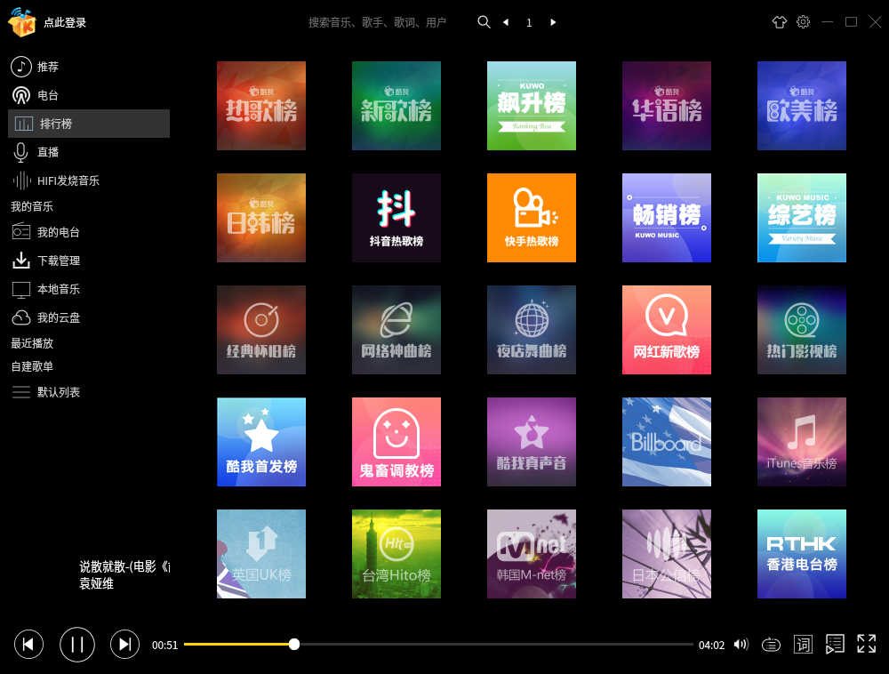
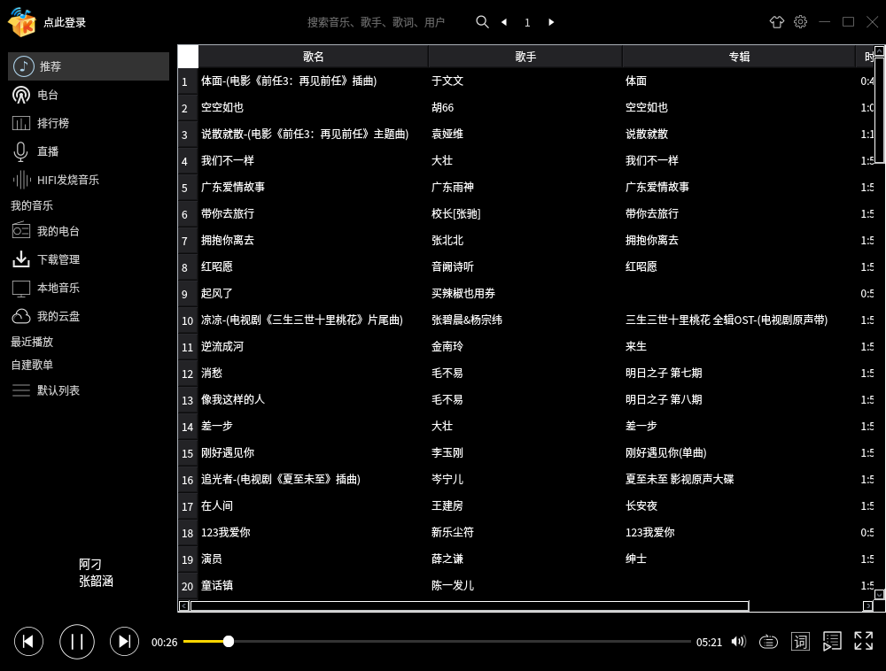
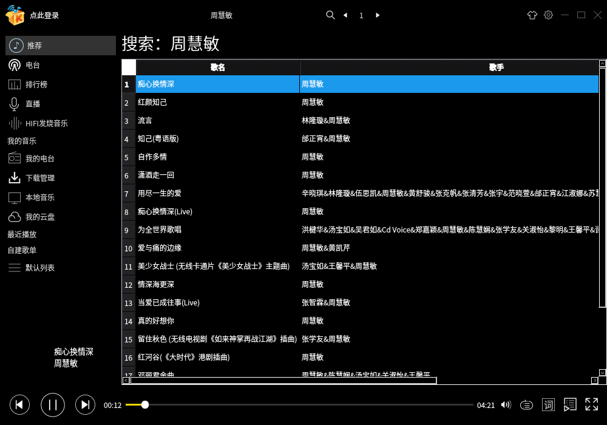

# Qt: 酷我音乐
一款基于 Qt5.6 的酷我音乐播放器，已编译好的 KuWo 适用于 Linux 64 位 Qt 5.6 环境。  
已完成功能：排行榜，搜索歌曲。  
音乐版权归酷我所有。  

  

  

  

  

### 参考
UI：酷我音乐  
API：  
https://www.cnblogs.com/daxiangxm/p/kuwo_music_api.html  ll
https://github.com/LiuLang/kwplayer